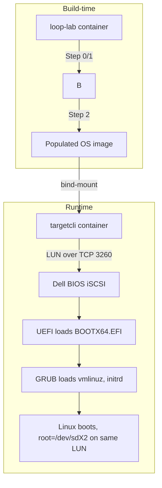

### Local development

```bash
# one-time after clone
git config core.hooksPath hooks

# run the image build in Docker manually
bash src/docker/run_in_docker.sh
```

```mermaid
graph TD
    subgraph Build-time
        A[loop-lab container] -->|Step 0/1| B
        B -->|Step 2| C[Populated OS image]
    end
    C -->|bind-mount| D[targetcli container]
    subgraph Runtime
        D -->|LUN over TCP 3260| E[Dell BIOS iSCSI]
        E --> F[UEFI loads BOOTX64.EFI]
        F --> G[GRUB loads vmlinuz, initrd]
        G --> H[Linux boots, root=/dev/sdX2 on same LUN]
    end
```
