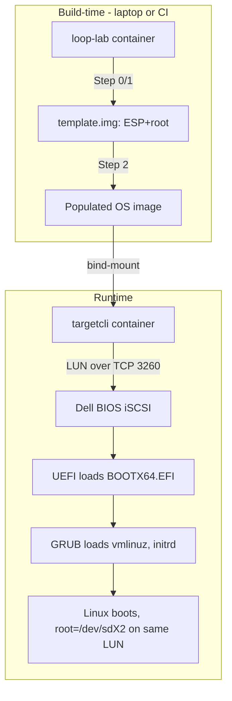

# Network Boot System

A containerized system for creating iSCSI-capable network boot disk images with UEFI support.

> **🔗 Related**: [Main Project Documentation](../../README.md) | [Docker Environment](../../infra/docker/README.md) | [Configuration Management](../../infra/config/README.md)

## Overview

This system creates bootable disk images that can be served over iSCSI for network booting. The images contain:
- EFI System Partition (ESP) with UEFI shell and boot infrastructure
- Root filesystem partition with Ubuntu minimal cloud image
- GPT partition table for modern UEFI systems

## Architecture Flow



## Components

### Assembly Scripts (`src/assembly/`)

- **[`build_image.sh`](src/assembly/build_image.sh)** - Core disk image creation with GPT partitioning
- **[`prep_esp.sh`](src/assembly/prep_esp.sh)** - EFI System Partition preparation and UEFI shell installation
- **[`import_rootfs.sh`](src/assembly/import_rootfs.sh)** - Ubuntu root filesystem import and configuration

### External Resources

The system automatically downloads and caches:
- **UEFI Shell** - `shellx64.efi` from pbatard/UEFI-Shell releases
- **Ubuntu Rootfs** - Minimal cloud image from cloud-images.ubuntu.com

### Build Process

1. **Cache Preparation**: Download external resources if not cached
2. **Docker Build**: Create container with build tools and scripts
3. **Image Creation**: 
   - Create 10GB sparse file
   - Set up GPT partition table (EFI + root)
   - Format partitions (FAT32 ESP, ext4 root)
   - Install UEFI shell and prepare boot infrastructure

## Configuration

External resource URLs and cache paths are managed via EDN configuration files in [`infra/config/src/`](../../infra/config/README.md):
- [`external_resources.edn`](../../infra/config/src/external_resources.edn) - Resource definitions  
- [`external_resources.bb`](../../infra/config/src/external_resources.bb) - Babashka script for processing

See the [Configuration Management documentation](../../infra/config/README.md) for details on the EDN format and resource definitions.

## Testing

Test scripts in [`test/`](test/) directory include:
- **Boot Tests**: [`boot_test.exp`](test/boot_test.exp), [`simple_boot_test.exp`](test/simple_boot_test.exp)
- **System Tests**: [`test_image.sh`](test/test_image.sh), [`test_boot_modes.sh`](test/test_boot_modes.sh)
- **Resource Tests**: [`test_external_resources.sh`](test/test_external_resources.sh)

## Manual Container Execution

For debugging or manual execution:
```bash
# Run container interactively
docker run -it --privileged \
  -v "$(pwd)/build:/output" \
  -v "$(pwd)/build/cache:/cache" \
  loop-lab-builder:latest bash

# Inside container, run individual scripts
build_image.sh x64
prep_esp.sh /output/template-x64.img x64
```

## Image Specifications

### Supported Architectures
- **x64**: Intel/AMD 64-bit with X64 UEFI
- **aarch64**: ARM 64-bit with AA64 UEFI

### Partition Layout
1. **EFI System Partition** (512MB, FAT32)
   - UEFI shell (`shellx64.efi` or `shellaa64.efi`)
   - Boot configuration
2. **Root Partition** (remaining space, ext4)
   - Ubuntu minimal root filesystem
   - System configuration

### External Dependencies
- Docker with privileged mode support
- Loop device support (`/dev/loop*`)
- Partition tools (`sgdisk`, `mkfs.vfat`, `mkfs.ext4`)
